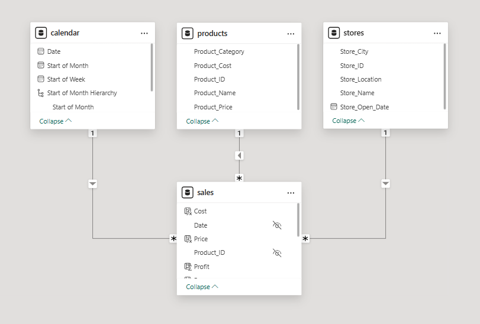

# Maven Toys - KPI Report (Power BI)

## 📌 Project Overview

**Goal:** Build a simple, interactive Power BI report for the leadership team to monitor key business metrics and high-level trends.

## 📊 The Situation & Assignment
Maven Toys operates multiple store locations across Mexico. The leadership team needed a clear way to track performance effectively. 

Using transactional data from **January 2022 to September 2023**, along with product and store location information, I was tasked with developing an interactive dashboard to surface critical insights and KPIs.

## 🎯 Objectives
To complete this project, the following workflow was executed:
1. **Connect and Profile Data:** Imported and cleaned raw CSV datasets.
2. **Create a Relational Model:** Built a robust data model connecting fact and dimension tables.
3. **Add Calculated Measures & Fields:** Utilized DAX to create custom KPIs and business logic.
4. **Build an Interactive Report:** Designed a user-friendly dashboard for executive review.

## 📁 Data Sources
The project utilizes the following datasets (located in the `data/` directory):
* **`sales.csv`**: Transactional records.
* **`products.csv`**: Information about the toys sold.
* **`stores.csv`**: Details on store locations across Mexico.
* **`calendar.csv`**: Date dimension table for time-intelligence reporting.

## 📈 Data Modeling
A robust relational data model (Star Schema) was created to ensure optimal performance and accurate filtering across the dashboard.

## 💻 Dashboard Preview
*(Click the link below to watch the dashboard in action)*

🎥 [Watch the Dashboard Demo](https://www.linkedin.com/posts/itsvinayakp_powerbi-dataanalytics-datavisualization-activity-7455989609051627521-9H9i?utm_source=share&utm_medium=member_desktop&rcm=ACoAAE3NYaUBD3CqflS31_34PO70nGVqHDEyvFI)

🖼️ [Dashboard Preview](assets/snapshot-of-dashboard.png)

## 🚀 How to Open
1. Clone or download this repository.
2. Open the `toy_store_kpi_report.pbit` (Power BI Template) file in Power BI Desktop.
3. Because this is a `.pbit` template, it does not store the raw data. When you open it, Power BI may prompt you to refresh the data. Ensure the file paths point to the downloaded `data/` folder on your local machine.